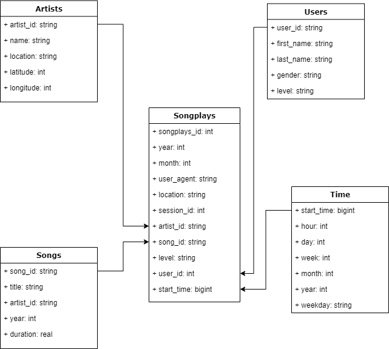

# Data Lake in AWS with Spark and S3

## Purpose/Goals

This project is used as an exercise to verify the concepts learned in the fourth module of the Data Engineering Nanodegree on Udacity.

*Sparkify* is a music app with a S3 data lake underneath to collect data related to songs listened and respective event logs.
A star schema data model for *sparkifydl* database has been implemented conceptually with the definition of fact and dimension tables.

The ETL pipeline extracts the information from JSON files hosted on S3 buckets and prepare the data via Spark before it is imported inside the
data lake.

## Schema design



### Main design

The data lake `sparkifydl` holds information about songs played and relative metadata. The star schema is made of:
    - *fact table*: `songplays`
    - *dimension tables*: `songs`, `users`, `time` and `artists`
 
Tables are stored in parquet files saved onto a S3 bucket specified in the `etl.py` script.
`time` and `songplays` are parquet files partitioned by *year* and month*, while `songs` is a parquet file paritioned by *year* and *artist_id*.

Two methods take care of ingesting the raw files in JSON format:
    - For the song files, it is possible to easily infer the schema.
    - The log files are ingested by manually defying the schema.
 
The data manipulation is performed via PySpark, an interface for Apache Spark in Python.

## How to run the project

1. Fill out the missing information from the `dl.cfg` file.
2. Create a S3 bucket where the output data will be stored and replace accordingly the value of `output_data` inside the script.
3. Create an EMR cluster via AWS Console with the follwoing specs:
    a. release *emr-5.20.0*
    b. 3 nodes (1 Master and 2 Slaves)
    c. make sure to have a paired key stored locally. Use that for security access.
    d. if the cluster is created via different machines, make sure to log onto the security group for the Master node and change the IP for the SSH inbound rule.
4. Connect to the created cluster via PuTTY or SSH command (always specify the paired key). SCP the  `dl.cfg` and `etl.py` onto the cluster. I personally use [WinSCP](https://winscp.net/eng/download.php)
5. After that run `spark-submit etl.py 1> spark.log` to run the pipeline on the EMR SSH console. It will collect the STDOUT into the `spark.log` file where it will be easier to debug any ETL issue on the fly.
6. When the ETL is completed, terminate the cluster via AWS Console.

## Query examples

1. Query number of songs in a given year
2. Query the average length of the longest 25 songs played per artist

```python
from pyspark.sql import SparkSession

spark = SparkSession \
        .builder \
        .config("spark.jars.packages", "org.apache.hadoop:hadoop-aws:2.7.0") \
        .getOrCreate()

q1 = "SELECT COUNT(*) from parquet.`s3a://data-lake-tables/songs_table.parquet/year=1964/*/*.parquet`"

res = spark.sql(q1).show()


parquetFile = spark.read.parquet("s3a://data-lake-tables/songplays_table.parquet/year=1964/*/*.parquet")

parquetFile.createOrReplaceTempView("parquetFile")

q2 = "SELECT song, AVG(duration) AS avg_duration FROM parquetFile GROUP BY song ORDER BY avg_duration LIMIT 25"

res = spark.sql(q2).show()
```

 
## Files in the repo

Important files inthe repository are:

- `etl.py`: coordinate the movement of data from S3 bucket to staging, and from staging to OLAP star schema.
- `imgs`: contains the PNG of the star schema.
- `dl.cfg`: contains configuration parameters for AWS.
